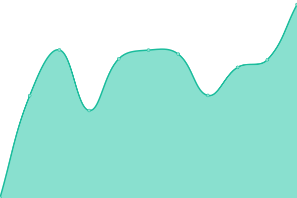

# [📈 Live Status](https://elepallec-th.github.io/upptime): <!--live status--> **🟩 All systems operational**

This repository contains the open-source uptime monitor and status page for [elepallec-th](https://elepallec-th.github.io/upptime), powered by [Upptime](https://github.com/upptime/upptime).

With [Upptime](https://upptime.js.org), you can get your own unlimited and free uptime monitor and status page, powered entirely by a GitHub repository. We use [Issues](https://github.com/elepallec-th/upptime/issues) as incident reports, [Actions](https://github.com/elepallec-th/upptime/actions) as uptime monitors, and [Pages](https://elepallec-th.github.io/upptime) for the status page.

<!--start: status pages-->
<!-- This summary is generated by Upptime (https://github.com/upptime/upptime) -->
<!-- Do not edit this manually, your changes will be overwritten -->
<!-- prettier-ignore -->
| URL | Status | History | Response Time | Uptime |
| --- | ------ | ------- | ------------- | ------ |
|  [CRL](http://crl.thalesgroup.com) | 🟩 Up | [crl.yml](https://github.com/elepallec-th/upptime/commits/HEAD/history/crl.yml) | 

 2591ms
     
 | 

<a href="https://elepallec-th.github.io/upptime/history/crl">98.66%</a>
    

|  [Identity Provider](https://sso-idp.thalesgroup.com) | 🟩 Up | [identity-provider.yml](https://github.com/elepallec-th/upptime/commits/HEAD/history/identity-provider.yml) | 

 3158ms
     
 | 

<a href="https://elepallec-th.github.io/upptime/history/identity-provider">98.78%</a>
    

|  [Single-Sign One](https://websso.online.thalesgroup.com/login/websso_login_unique.pl) | 🟩 Up | [single-sign-one.yml](https://github.com/elepallec-th/upptime/commits/HEAD/history/single-sign-one.yml) | 

 1390ms
     
 | 

<a href="https://elepallec-th.github.io/upptime/history/single-sign-one">98.89%</a>
    

|  [CRL HTTP Port](192.54.144.100) | 🟩 Up | [crl-http-port.yml](https://github.com/elepallec-th/upptime/commits/HEAD/history/crl-http-port.yml) | 

 114ms
     
 | 

<a href="https://elepallec-th.github.io/upptime/history/crl-http-port">100.00%</a>
    

|  [SSO HTTPS Port](192.54.144.12) | 🟩 Up | [sso-https-port.yml](https://github.com/elepallec-th/upptime/commits/HEAD/history/sso-https-port.yml) | 

 114ms
     
 | 

<a href="https://elepallec-th.github.io/upptime/history/sso-https-port">100.00%</a>
    

|  [IdP HTTPS Port](192.54.144.69) | 🟩 Up | [id-p-https-port.yml](https://github.com/elepallec-th/upptime/commits/HEAD/history/id-p-https-port.yml) | 

 114ms
     
 | 

<a href="https://elepallec-th.github.io/upptime/history/id-p-https-port">100.00%</a>
    

<!--end: status pages-->

[**Visit our status website →**](https://elepallec-th.github.io/upptime)

## 📄 License

- Powered by: [Upptime](https://github.com/upptime/upptime)
- Code: [MIT](./LICENSE) © [elepallec-th](https://elepallec-th.github.io/upptime)
- Data in the `./history` directory: [Open Database License](https://opendatacommons.org/licenses/odbl/1-0/)
