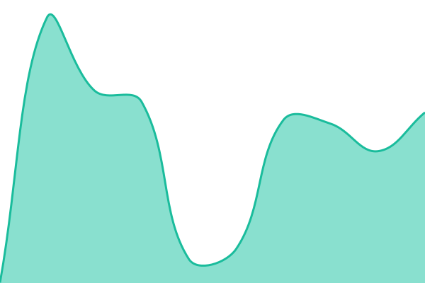
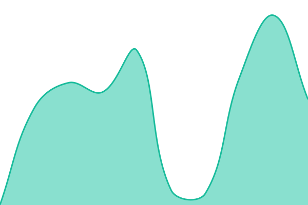
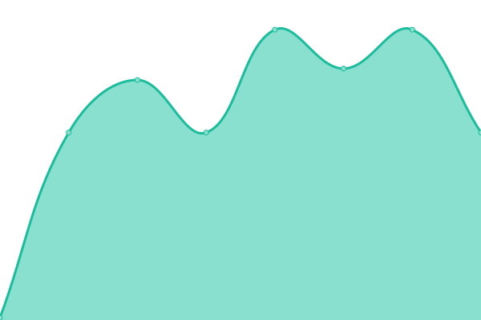
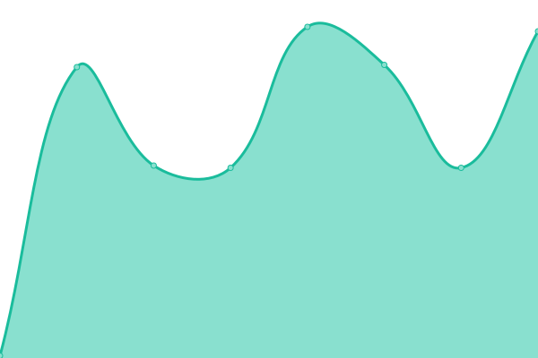

# [📈 Live Status](https://elp-th.github.io/upptime): <!--live status--> **🟧 Partial outage**

This repository contains the open-source uptime monitor and status page for [elp-th](https://elp-th.github.io/upptime), powered by [Upptime](https://github.com/upptime/upptime).

With [Upptime](https://upptime.js.org), you can get your own unlimited and free uptime monitor and status page, powered entirely by a GitHub repository. We use [Issues](https://github.com/elp-th/upptime/issues) as incident reports, [Actions](https://github.com/elp-th/upptime/actions) as uptime monitors, and [Pages](https://elp-th.github.io/upptime) for the status page.

<!--start: status pages-->
<!-- This summary is generated by Upptime (https://github.com/upptime/upptime) -->
<!-- Do not edit this manually, your changes will be overwritten -->
<!-- prettier-ignore -->
| URL | Status | History | Response Time | Uptime |
| --- | ------ | ------- | ------------- | ------ |
|  CRL v4 | 🟩 Up | [crl-v4.yml](https://github.com/elp-th/upptime/commits/HEAD/history/crl-v4.yml) | 

 294ms
     
 | 

<a href="https://elp-th.github.io/upptime/history/crl-v4">100.00%</a>
    

|  Identity Provider | 🟩 Up | [identity-provider.yml](https://github.com/elp-th/upptime/commits/HEAD/history/identity-provider.yml) | 

 511ms
     
 | 

<a href="https://elp-th.github.io/upptime/history/identity-provider">100.00%</a>
    

|  Single-Sign On | 🟩 Up | [single-sign-on.yml](https://github.com/elp-th/upptime/commits/HEAD/history/single-sign-on.yml) | 

 624ms
     
 | 

<a href="https://elp-th.github.io/upptime/history/single-sign-on">100.00%</a>
    

|  ADFS | 🟩 Up | [adfs.yml](https://github.com/elp-th/upptime/commits/HEAD/history/adfs.yml) | 

 613ms
     
 | 

<a href="https://elp-th.github.io/upptime/history/adfs">100.00%</a>
    

|  OneAccess HUB | 🟩 Up | [one-access-hub.yml](https://github.com/elp-th/upptime/commits/HEAD/history/one-access-hub.yml) | 

 465ms
     
 | 

<a href="https://elp-th.github.io/upptime/history/one-access-hub">100.00%</a>
    

|  OneAccess U2A | 🟩 Up | [one-access-u2-a.yml](https://github.com/elp-th/upptime/commits/HEAD/history/one-access-u2-a.yml) | 

 413ms
     
 | 

<a href="https://elp-th.github.io/upptime/history/one-access-u2-a">100.00%</a>
    

|  CRL HTTP Port | 🟩 Up | [crl-http-port.yml](https://github.com/elp-th/upptime/commits/HEAD/history/crl-http-port.yml) | 

 119ms
     
 | 

<a href="https://elp-th.github.io/upptime/history/crl-http-port">100.00%</a>
    

|  SSO HTTPS Port | 🟥 Down | [sso-https-port.yml](https://github.com/elp-th/upptime/commits/HEAD/history/sso-https-port.yml) | 

 0ms
     
 | 

<a href="https://elp-th.github.io/upptime/history/sso-https-port">0.00%</a>
    

|  IdP HTTPS Port | 🟥 Down | [id-p-https-port.yml](https://github.com/elp-th/upptime/commits/HEAD/history/id-p-https-port.yml) | 

 0ms
     
 | 

<a href="https://elp-th.github.io/upptime/history/id-p-https-port">0.00%</a>
    

|  ADFS HTTPS Port | 🟩 Up | [adfs-https-port.yml](https://github.com/elp-th/upptime/commits/HEAD/history/adfs-https-port.yml) | 

 119ms
     
 | 

<a href="https://elp-th.github.io/upptime/history/adfs-https-port">100.00%</a>
    

<!--end: status pages-->

[**Visit our status website →**](https://elp-th.github.io/upptime)

## 📄 License

- Powered by: [Upptime](https://github.com/upptime/upptime)
- Code: [MIT](./LICENSE) © [elp-th](https://elp-th.github.io/upptime)
- Data in the `./history` directory: [Open Database License](https://opendatacommons.org/licenses/odbl/1-0/)
